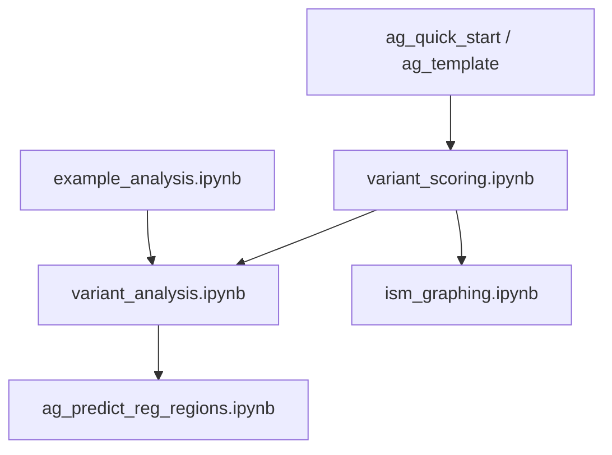

# LMNA AlphaGenome Notebooks

This repository’s [`notebooks/`](notebooks/) folder contains Jupyter notebooks for **LMNA-focused AlphaGenome analysis**: variant filtering and batch scoring, single-variant effect prediction, regulatory element context, in silico mutagenesis (ISM) visualization, and genomic track plotting.

Run notebooks with the **AlphaGenome (`py311` / AG) Jupyter kernel**, as noted in several notebook headers.

## Prerequisites

- Python environment with [AlphaGenome](https://www.alphagenomedocs.com/) installed
- Jupyter kernel configured for AlphaGenome (notebooks reference the AG / `py311` kernel)
- Common libraries used across notebooks: `alphagenome`, `pysam`, `pandas`, `matplotlib`, and `plotnine` (where applicable)

Several notebooks load inputs via absolute paths defined inside the notebook cells. Update those paths to match your local setup before running.

## Suggested workflow

A typical analysis path: start with a tutorial notebook, filter and score variants, explore individual variant effects and annotations, then add regulatory-region predictions and ISM plots.

## Notebook guide

### Getting started / tutorials

| Notebook | Description |
|----------|-------------|
| [`ag_quick_start.ipynb`](notebooks/ag_quick_start.ipynb) | Full AlphaGenome quick-start tutorial: sequence predictions, visualization, variant scoring, and ISM |
| [`alphagenome.ipynb`](notebooks/alphagenome.ipynb) | Copy of the AlphaGenome quick-start tutorial |
| [`ag_research_quick_start.ipynb`](notebooks/ag_research_quick_start.ipynb) | Research-oriented quick start: model loading and paper figure reproduction |
| [`ag_template.ipynb`](notebooks/ag_template.ipynb) | Minimal starter with standard imports and `dna_model` setup |

### LMNA variant workflow

| Notebook | Description | Key APIs |
|----------|-------------|----------|
| [`variant_scoring.ipynb`](notebooks/variant_scoring.ipynb) | End-to-end pipeline: filter VCF variants near LMNA by genomic window and clinical significance, convert VCF to CSV, batch-score variants with AlphaGenome scorers, export heart-tissue scores | `pysam.VariantFile`, `gene_annotation.get_gene_interval`, `dna_model.score_variant`, `variant_scorers.tidy_scores` |
| [`variant_analysis.ipynb`](notebooks/variant_analysis.ipynb) | Deeper variant exploration: visualize pathogenic variant positions, run single-variant predictions, parse SnpEff `ANN` fields, overlay BED annotation tracks on transcript plots | `plot_components.plot`, `dna_model.predict_variant`, `IntervalAnnotation`, `plot_ax` |
| [`example_analysis.ipynb`](notebooks/example_analysis.ipynb) | Example analysis workflow from AlphaGenome docs: LMNA variant positions, background-variant utilities, single-variant `predict_variant` | `genome.Variant`, `plot_components.VariantAnnotation`, utilities from the example analysis colab |

### Regulatory context and ISM

| Notebook | Description | Key APIs |
|----------|-------------|----------|
| [`ag_predict_reg_regions.ipynb`](notebooks/ag_predict_reg_regions.ipynb) | LMNA regulatory-region analysis: `predict_interval` for heart tissue across multiple output types, load cCRE intervals as `genome.Interval`, plot multi-track predictions with ENCODE-colored cCRE overlays and contact maps | `dna_model.predict_interval`, `plot_components.Tracks`, `plot_components.IntervalAnnotation`, `plot_components.ContactMaps` |
| [`ism_graphing.ipynb`](notebooks/ism_graphing.ipynb) | Import and visualize ISM delta scores: sequence logo, per-position importance summaries, cCRE and FANTOM5 annotation tracks below ISM plots | `ism.ism_matrix`, `plot_components.SeqLogo`, matplotlib subplots with `axvspan` / `broken_barh` |

## Supporting files in `notebooks/`

| File | Description |
|------|-------------|
| [`snpeff_cmds.txt`](notebooks/snpeff_cmds.txt) | Reference SnpEff commands for basic annotation and custom BED-interval annotation |
| [`lmna_missense.vcf`](notebooks/lmna_missense.vcf) | Example filtered VCF (missense variants) |
| [`lmna_predictions.png`](notebooks/lmna_predictions.png) | Saved prediction plot |
| [`lmna_predictions_1MB.png`](notebooks/lmna_predictions_1MB.png) | Saved prediction plot (1 MB sequence window) |

## Security note

Several notebooks contain hardcoded API keys in `dna_client.create(...)` cells. Rotate any exposed keys and prefer environment variables or a secrets file before sharing this repository publicly. Do not commit credentials to version control.

## External references

Notebooks link to official AlphaGenome documentation and colabs where relevant, for example:

- [Batch variant scoring](https://www.alphagenomedocs.com/colabs/batch_variant_scoring.html)
- [Example analysis workflow](https://www.alphagenomedocs.com/colabs/example_analysis_workflow.html)
- [SnpEff non-coding variant examples](https://pcingola.github.io/SnpEff/examples/#example-3-non-coding-variants) (referenced in `snpeff_cmds.txt`)
